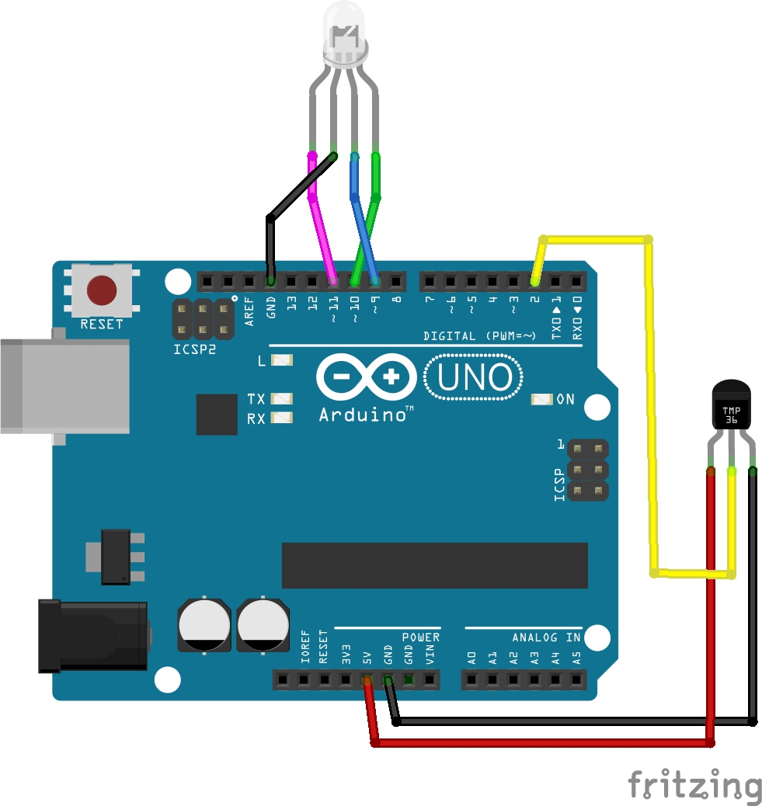

# GLITCH
GLITCH is an artwork that is displaying your environmental temperature in changing its color. A build in ARDUINO UNO, temperature sensor (18B20) and a LED (SMD 3RGB) is showing 8 color spectrums according to temperature set in the code.

# Hardware Required

ARDUINO UNO, temperature sensor (18B20), LED (SMD 3RGB), wires

# Schematic diagram

